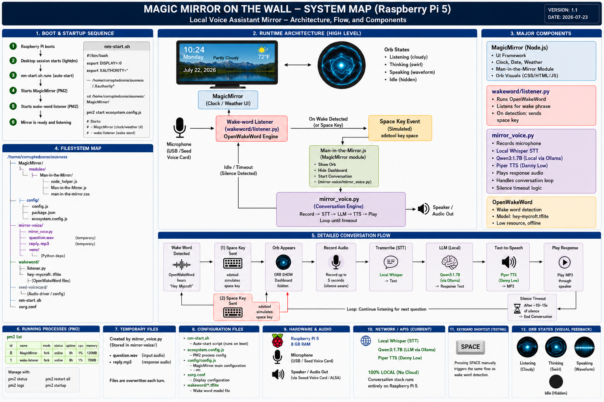

# 🪞 Magic Mirror AI

An AI-powered smart mirror built on a Raspberry Pi that combines local voice recognition, large language models, animated visual feedback, and modern human-computer interaction.

This project began as a standard MagicMirror² installation and has evolved into an interactive AI system capable of holding natural conversations through a fully local voice pipeline.

**Current Status:** Functional prototype under active development.

---

# Overview

Magic Mirror AI is an embedded AI project that explores how modern language models, speech recognition, and animated interfaces can transform an ordinary mirror into an interactive assistant.

The long-term vision is to create a conversational AI presence that lives behind the glass—one that can recognize when someone approaches, respond naturally through speech, and present information through a dynamic visual interface.

---

# Current Features

## Smart Mirror

- MagicMirror² dashboard
- Clock
- Date
- Weather
- Clean dark-themed interface

## Local AI Voice Assistant

- Local wake-word detection
- Multi-turn voice conversations
- Local Speech-to-Text (Whisper)
- Local Large Language Model (Qwen)
- Local Text-to-Speech (Piper)
- Automatic silence timeout

## Animated Orb Interface

During conversations the standard mirror interface is replaced with animated AI states.

- 🎤 Listening
- 🧠 Thinking
- 🔊 Speaking

The orb provides visual feedback so the user always knows what the AI is doing.

---

# System Architecture

```
                    User
                      │
                Wake Word
                      │
                      ▼
              Speech-to-Text
                 (Whisper)
                      │
                      ▼
              Local LLM (Qwen)
                      │
                      ▼
              Text-to-Speech
                  (Piper)
                      │
                      ▼
                 Audio Output
                      │
                      ▼
            Return to Smart Mirror

```
## System Architecture



---

# Technologies Used

## Hardware

- Raspberry Pi 5 (8 GB)
- HDMI Monitor
- USB Microphone
- USB Speaker
- Two-Way Mirror
- Custom Frame

## Software

- Python
- JavaScript
- HTML
- CSS
- Linux
- MagicMirror²
- Ollama
- Qwen
- Whisper
- Piper
- OpenWakeWord

---

# Project Goals

## Voice Interaction

- Natural conversations
- Fast response times
- Streaming responses
- Improved speech synchronization

## Visual Experience

- Smooth orb animations
- Voice-reactive effects
- Dynamic lighting
- Holographic-inspired interface

## AI

- Personality-driven responses
- Long-term memory
- Context awareness
- Tool use
- Live information retrieval

## Computer Vision

- Camera support
- Person detection
- Face recognition
- Personalized greetings

## Sensors

- Motion detection
- Temperature
- Humidity
- Ambient lighting

## Hardware Improvements

- Two-way mirror glass
- Custom enclosure
- Improved microphone
- Better speakers
- LED accent lighting

---

# Future Roadmap

- Custom wake phrase
- Response streaming
- Reduced latency
- Voice synchronization
- Camera integration
- Face recognition
- Smart notifications
- Calendar integration
- Local memory
- Home automation support
- Modular plugin architecture

---

# Gallery

*Screenshots and project photos will be added as development continues.*

- Smart Mirror UI
- Listening Orb
- Thinking Orb
- Speaking Orb
- Hardware Assembly
- Finished Mirror

---

# About This Project

This project serves as both a personal learning platform and a long-term exploration of embedded AI systems.

It combines embedded hardware, local artificial intelligence, voice interfaces, Linux development, and modern web technologies into a single interactive device.

The goal is not simply to build a smart mirror, but to explore what a natural, conversational human-computer interface can look like when it runs locally on affordable hardware.

---

# Project Status

🚧 Active Development

Major functionality is operational, with ongoing work focused on performance, latency reduction, user experience, and additional AI capabilities.

---

# License

MIT License

---

# Author

Trevor Youmans

GitHub: **CorruptedConsciousness**

*"Building practical embedded AI systems one project at a time."*
